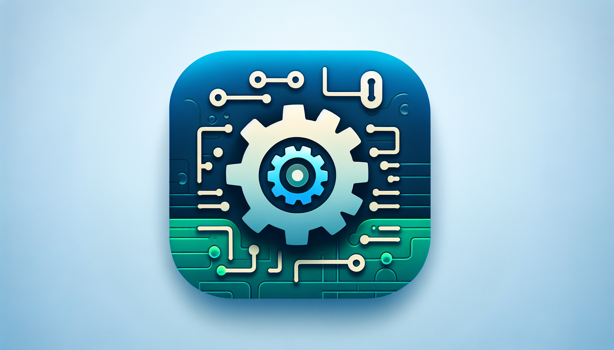

<div id="top">

<!-- HEADER STYLE: CLASSIC -->
<div align="center">



# DJANGO_ERP

<em>Transforming Business Operations with Scalable Power</em>

<!-- BADGES -->


<em>Built with the tools and technologies:</em>


<br>


</div>
<br>

---

## 📄 Table of Contents

- [Overview](#-overview)
- [Project Architecture](#-project-architecture)
- [Core Modules](#-core-modules)
- [Getting Started](#-getting-started)
    - [Prerequisites](#-prerequisites)
    - [Installation](#-installation)
    - [Usage](#-usage)
    - [Testing](#-testing)
- [License](#-license)

---

## ✨ Overview

Django_ERP is a comprehensive enterprise resource planning system designed to streamline and automate complex business operations through a modular, developer-friendly architecture. The core features include:

- 🧩 **Modular Architecture:** Modular design supporting inventory, sales, delivery, and more with clear separation of concerns through Service Pattern implementation.
- 🌐 **API Framework:** Extensive REST API with versioning and consistent serializer patterns, enabling seamless integration across systems.
- ⚡ **Real-time Features:** Real-time updates via WebSocket, ensuring instant communication for delivery tracking and notifications.
- 🔄 **Event System:** Comprehensive signals and event-driven automation using business validators for inventory, purchase orders, and workflows.
- 🛠️ **Multi-tenant Design:** Built-in multi-tenant support through BaseModel with automatic company filtering and user tracking.
- 📚 **Self-documenting API:** Comprehensive OpenAPI schema documentation using drf-spectacular for accelerated development.

---

## 🚀 Getting Started

### 📋 Prerequisites

This project requires the following dependencies:

- **Programming Language:** Python
- **Package Manager:** Pip
- **Container Runtime:** Docker

### ⚙️ Installation

Build Django_ERP from the source and install dependencies:

1. **Clone the repository:**

    ```sh
    ❯ git clone https://github.com/luizmoretti/Django_ERP
    ```

2. **Navigate to the project directory:**

    ```sh
    ❯ cd Django_ERP
    ```

3. **Install the dependencies:**

**Using [docker](https://www.docker.com/):**

```sh
❯ docker build -t luizmoretti/Django_ERP .
```
**Using [pip](https://pypi.org/project/pip/):**

```sh
❯ pip install -r BackEnd/requirements.txt
```

### 💻 Usage

Run the project with:

**Using [docker](https://www.docker.com/):**

```sh
docker run -it luizmoretti/Django_ERP
```
**Using [pip](https://pypi.org/project/pip/):**

```sh
python manage.py runserver
```

### 🧪 Testing

Django_ERP supports both Django's built-in test framework and pytest. Run the test suite with:

**Using [docker](https://www.docker.com/):**

```sh
docker exec -it django_erp python manage.py test
```
**Using [pip](https://pypi.org/project/pip/):**

```sh
pytest
```

## 🏗️ Project Architecture

Django_ERP implements a well-structured, layered architecture based on modern software design principles:

### Service Pattern

The system implements a comprehensive Service Pattern with clear separation of responsibilities:

- **Services/Handlers:** Encapsulate business logic in atomic transactions
- **Services/Validators:** Implement business rules and validation logic
- **Services/Reports:** Generate specialized domain reports

### Model Hierarchy

- **BaseModel:** Foundation for all models with:
  - UUID primary keys for distribution-friendly identifiers
  - Multi-tenant support via company field
  - Automatic audit fields (created_at, updated_at, created_by, updated_by)
  - Automated company inheritance for data isolation

- **BaseAddressWithBaseModel:** Extension with standardized address and contact fields

### API Architecture

- **Serializers:** Consistent pattern with read/write field separation
- **Views:** Hierarchical structure with base classes for common behavior
- **Permissions:** Granular permission system with company-aware filtering

---

## 🧩 Core Modules

### Inventory Management

- **Warehouses:** Management of storage locations with capacity tracking
- **Inflows:** Product entries from suppliers to warehouses
- **Transfers:** Internal movement between warehouses
- **Outflows:** Product exits from warehouses to customers

### Human Resources

- **Employees:** Complete employee management with position hierarchy
- **Attendance:** Time tracking with support for hourly and daily payment
- **Payroll:** Automated payroll calculation based on attendance

### Vehicle Fleet

- **Vehicles:** Comprehensive vehicle management with assignment tracking
- **Drivers:** Assignment and qualification management
- **Tracking:** Vehicle usage and availability monitoring

### User Management

- **Accounts:** Custom user model with email-based authentication
- **Profiles:** Extended user profiles with role-based permissions
- **Multi-tenant:** Company-based data isolation throughout the system

---

## 📜 License

Django_erp is protected under the [LICENSE](https://choosealicense.com/licenses) License. For more details, refer to the [LICENSE](https://choosealicense.com/licenses/) file.

---

<div align="left"><a href="#top">⬆ Return</a></div>

---
